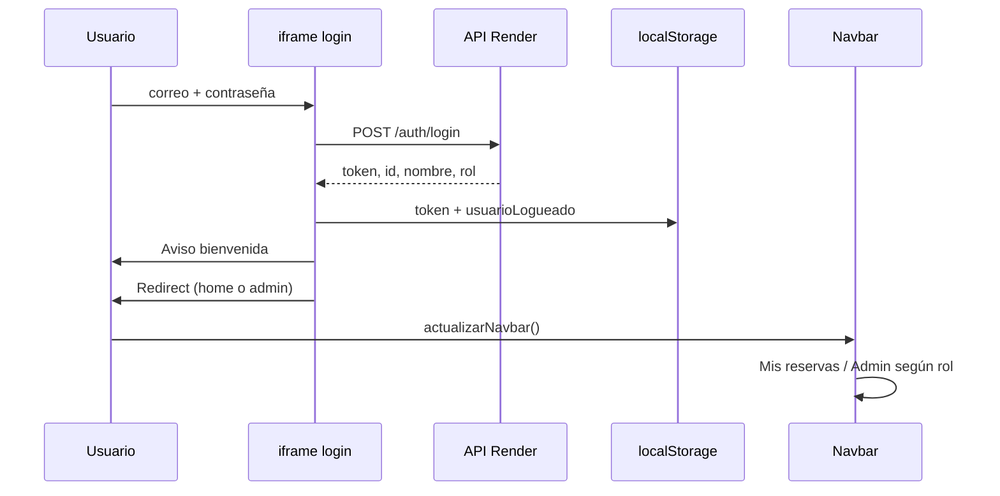

# Style Factory — Frontend

Interfaz web de **Style Factory** — **sistema de gestión de reservas** para salón de belleza (proyecto final **Full-Stack Java**, Generation Colombia). Este repositorio es el **cliente frontend**; la lógica de negocio, persistencia y seguridad viven en el backend **[Java 17 + Spring Boot](https://github.com/EnithV/stylefactory-backend)** (JWT, JPA, PostgreSQL en Supabase).

El sitio permite explorar servicios, registrarse, reservar citas con estilistas, gestionar el **perfil del cliente** (datos, estadísticas e historial de reservas) y —con rol `ADMIN`— administrar servicios, reservas y empleados desde un panel de control.

Las imágenes del catálogo y estilistas se sirven desde **assets locales** en GitHub Pages (sin dependencia de Cloudinary en producción).

Está construido con **HTML, CSS y JavaScript** vanilla (sin React ni Vue). Los componentes reutilizables (navbar, footer, formularios) se cargan dinámicamente con `fetch`. La autenticación y los datos de negocio se obtienen del API REST en Render.

---

## Enlaces del proyecto

| Recurso | URL |
|---------|-----|
| **Sitio publicado** | https://enithv.github.io/stylefactory/ |
| **Repositorio frontend** | https://github.com/EnithV/stylefactory |
| **API (Render)** | https://stylefactoryapi.onrender.com |
| **Repositorio backend** | https://github.com/EnithV/stylefactory-backend |
| **Swagger** | https://stylefactoryapi.onrender.com/swagger-ui/index.html |

---

## Stack tecnológico

### Proyecto completo (frontend + backend)

| Capa | Tecnologías |
|------|-------------|
| Backend | **Java 17**, Spring Boot 4, Spring Security, JWT, JPA, PostgreSQL (Supabase) |
| Frontend (este repo) | HTML5, CSS3, JavaScript ES6+, Bootstrap 5, Leaflet |
| Despliegue | GitHub Pages (frontend), Render (API Java) |

### Frontend (este repositorio)

| Tecnología | Uso |
|------------|-----|
| HTML5 | Páginas y componentes |
| CSS3 | Estilos por página/componente; variables CSS de marca |
| JavaScript ES6+ | Lógica, módulos ES6 en catálogo y admin |
| Bootstrap 5.3.8 | Grid, navbar, modales, carrusel |
| Google Fonts | Montserrat, Playfair Display |
| Font Awesome 6 | Iconos |
| Formspree | Envío del formulario de contacto (externo al API) |
| Leaflet + OpenStreetMap (CARTO) | Mapa en página de contacto (sin API key) |
| JWT | Sesión vía `localStorage` + API backend |

---

## Mapa del sitio

Todas las rutas del menú usan el prefijo **`/stylefactory/`** porque GitHub Pages publica este repositorio como sitio de proyecto bajo `enithv.github.io`.

| Sección | Ruta relativa | Descripción |
|---------|---------------|-------------|
| Inicio | `/index.html` | Banner, servicios destacados, reseñas, info del salón |
| Servicios | `/pages/catalogoServicios/` | Catálogo con filtros por categoría |
| Nosotros | `/pages/aboutUs/` | Historia, valores, equipo |
| Contacto | `/pages/contact/` | Formulario Formspree + mapa |
| Login | `/pages/login/` | Formulario en iframe |
| Registro | `/pages/registro/` | Alta de clientes en iframe |
| Reservas | `/pages/reservations/` | Flujo: servicio → estilista → fecha/hora → confirmar |
| Mi perfil | `/pages/perfilUsuario/` | Hub del cliente: datos, stats, reservas, editar perfil |
| Mis reservas | `/pages/misReservas/` | Redirige a `perfilUsuario.html#reservas` (compatibilidad) |
| Admin | `/pages/admin/panelDeControl/` | Panel: métricas, servicios, reservas y empleados |

---

## Estructura del proyecto

```
stylefactory/
├── index.html
├── assets/
│   ├── css/
│   │   └── main.css
│   └── js/
│       ├── config.js                 # API_BASE, urlApp(), navbar, imágenes
│       ├── apiClient.js              # Módulo ES6: CRUD servicios/reservas
│       ├── imageAssets.js            # URLs locales + mapa legacy Cloudinary
│       ├── sfAlert.js                # Modales de alerta (admin y formularios)
│       ├── formValidaciones.js       # Validaciones compartidas
│       ├── productosCatalogo.js      # Fallback local del catálogo
│       ├── reservaPendiente.js       # Progreso de reserva sin sesión
│       └── main.js                   # Home: carga de secciones
│   └── images/                       # Imágenes locales (servicios, empleados, etc.)
├── components/
│   ├── navbar/
│   │   └── navbar.html
│   ├── footer/
│   ├── bannerInicio/
│   ├── ServiciosDestacados/
│   ├── review/
│   ├── confirmacionServicio/       # Modal y POST /reservas
│   ├── metricas/                   # Gráficos del panel admin (datos demo)
│   ├── maps/                       # Mapa de contacto
│   └── forms/
│       ├── loginUsuario/           # iframe en pages/login
│       ├── registroUsuario/        # iframe en pages/registro
│       ├── contacto/               # iframe en pages/contact
│       ├── creacionServicios/       # iframe en admin lista servicios
│       ├── passwordToggle.js       # Mostrar/ocultar contraseña
│       └── passwordToggle.css
├── pages/
│   ├── login/
│   ├── registro/
│   ├── contact/
│   ├── catalogoServicios/
│   ├── aboutUs/
│   ├── reservations/
│   ├── perfilUsuario/                # Hub del cliente autenticado
│   ├── misReservas/                  # Redirección al perfil
│   └── admin/
│       ├── panelDeControl/
│       ├── listaServicios/
│       ├── listaReservas/
│       └── empleados/                # CRUD estilistas + horarios
└── dataBase/                         # Scripts SQL de referencia (Supabase)
    ├── seed_catalogo_stylefactory.sql
    ├── migracion_imagenes_locales.sql
    ├── migracion_duracion_servicios.sql
    └── query_base_de_datos.sql       # Esquema legacy del curso (no usar en prod)
```

---

## Configuración (`assets/js/config.js`)

```javascript
const API_BASE = "https://stylefactoryapi.onrender.com";
const FRONTEND_BASE_URL = "https://enithv.github.io/stylefactory";
const GITHUB_PAGES_BASE_PATH = "/stylefactory";
```

### Funciones globales

| Función | Propósito |
|---------|-----------|
| `obtenerBaseAplicacion()` | Detecta `/stylefactory` en GitHub Pages o raíz en local |
| `urlApp('/pages/login/login.html')` | Arma rutas absolutas para redirecciones desde iframes |
| `saludoNavbar(nombre)` | Primer nombre en el navbar |
| `marcarEnlaceNavbarActivo()` | Resalta la página actual en el menú |
| `resolverUrlImagen(url)` | Cloudinary legacy → URL en GitHub Pages |
| `actualizarNavbar()` / `cerrarSesion()` | Sesión compartida en todas las páginas públicas |
| `cargarLayoutPublico()` | Carga navbar y footer desde componentes HTML |
| `configurarEnlacesPerfilNavbar()` | Enlaces dinámicos a perfil y reservas |
| `actualizarEnlacesNavbarSesion()` | Muestra «Mis reservas» y «Administrador» si hay sesión |
| `mensajeErrorConexion(error)` | Texto claro ante NetworkError o cold start de Render |

### Desarrollo contra API local

Cambiar temporalmente:

```javascript
const API_BASE = "http://localhost:8081";
```

El backend debe tener CORS habilitado para `http://localhost:*` (ya configurado en `CorsConfig.java`).

---

## Sesión y almacenamiento local

### Claves en `localStorage`

| Clave | Contenido | Cuándo se escribe |
|-------|-----------|-------------------|
| `token` | JWT del API | Login exitoso |
| `usuarioLogueado` | `{ id, nombre, correo, rol }` | Login exitoso |
| `servicioSeleccionado` | Objeto servicio del catálogo | Usuario elige «Reservar» |
| `Lista de Servicios` | (legacy) cache opcional de servicios | Fallback admin antiguo |

### Claves en `sessionStorage` (`reservaPendiente.js`)

| Clave | Propósito |
|-------|-----------|
| `reservaPendienteDatos` | Progreso de reserva si el usuario no tenía sesión |
| `retomarReserva` | Flag para volver al flujo tras login/registro |

El token **no** se persiste en Supabase; vive en el navegador hasta expiración (24 h) o cierre de sesión.

---

## Autenticación

### Login

1. Formulario en `components/forms/loginUsuario/` dentro de un **iframe** en `pages/login/`.
2. `POST {API_BASE}/auth/login` con `{ correo, contrasena }`.
3. Guarda `token` y `usuarioLogueado`.
4. Muestra aviso de bienvenida (estilo editorial, ~1,5 s).
5. Redirección según rol y contexto:

| Condición | Destino |
|-----------|---------|
| Hay reserva pendiente en `sessionStorage` | `/pages/reservations/?retomar=1` |
| Rol `ADMIN` | `/pages/admin/panelDeControl/panelControl.html` |
| Cliente | `/index.html` |

### Registro

1. Validación en cliente (`formValidaciones.js`).
2. `POST /auth/register` con rol `CLIENTE`.
3. Mensaje de éxito → redirect a `/pages/login/login.html?registro=exito`.
4. La página login muestra aviso «Cuenta registrada» sobre el iframe.

### Navbar con sesión

- Sin sesión: botón «Iniciar sesión».
- Con sesión: **«Hola, {primer nombre}»** (enlace al perfil) + «Cerrar sesión».
- Enlaces condicionales: **Mis reservas** → `perfilUsuario.html#reservas`, **Administrador** (solo `ADMIN`).



---

## Validaciones de formularios

Centralizadas en `assets/js/formValidaciones.js`:

| Campo | Reglas |
|-------|--------|
| Nombre | Solo letras, espacios, apóstrofes; sin números; aviso en tiempo real |
| Correo | Obligatorio; formato válido |
| Teléfono | Solo dígitos y separadores (`+`, `-`, espacios); longitud 7–15 dígitos |
| Contraseña | Mín. 8 caracteres; mayúscula, minúscula, número y símbolo |
| Confirmación | Debe coincidir con contraseña |
| Mensaje (contacto) | Mín. 10 caracteres |

Login y registro usan **`novalidate`** para mostrar errores en español (evita tooltips nativos ocultos dentro del iframe).

**Contraseña visible:** `components/forms/passwordToggle.js` + estilos en `passwordToggle.css`.

---

## Integración con el backend

### Cliente API (`assets/js/apiClient.js`)

Módulo ES6 importado con `type="module"` en catálogo y páginas admin.

| Función | Endpoint | Método |
|---------|----------|--------|
| `listarServicios()` | `/servicios` | GET (público) |
| `crearServicio(payload)` | `/servicios` | POST |
| `actualizarServicio(id, payload)` | `/servicios/{id}` | PUT |
| `eliminarServicio(id)` | `/servicios/{id}` | DELETE |
| `listarReservas()` | `/reservas` | GET |
| `eliminarReserva(id)` | `/reservas/{id}` | DELETE |
| `actualizarEstadoReserva(id, estado)` | `/reservas/{id}/estado` | PATCH |

Estados de reserva: `PENDIENTE`, `CONFIRMADA`, `CANCELADA`, `COMPLETADA`.

Todas las peticiones autenticadas envían:

```http
Authorization: Bearer {token}
Content-Type: application/json
```

### Catálogo de servicios

`pages/catalogoServicios/catalogoServicios.js`:

1. Intenta `GET /servicios` (público, sin token).
2. Si falla, usa fallback de `productosCatalogo.js` o `localStorage`.
3. Filtros por categoría (`tipo` / `tipoServicio`).
4. Al reservar, guarda `servicioSeleccionado` y redirige a `/pages/reservations/`.

### Flujo de reserva

`pages/reservations/reservations.js` + `components/confirmacionServicio/confirmacionServicio.js`:

1. Muestra servicio desde `localStorage`.
2. Estilistas desde `GET /empleados/catalogo` (fallback local si el API no responde).
3. Horarios desde `GET /horarios` cuando hay datos; si no, genera slots 9:00–18:00.
4. Calendario y slots con reglas en zona **America/Bogota**:
   - Atención 9:00 a.m. – 8:00 p.m.
   - Último inicio de cita: 6:00 p.m.
   - Duración según `duracionMinutos` del servicio.
5. Si no hay sesión: guarda progreso en `sessionStorage` y pide login/registro.
6. Confirmación: `POST /reservas` con `estado: "CONFIRMADA"`.
7. Modal de éxito y redirección a **`perfilUsuario.html#reservas`**.

> **Nota:** El API valida las reglas reales de horario en `ReservaService`. La UI puede mostrar slots generados si la BD no tiene horarios cargados para el estilista.

### Perfil del cliente (`pages/perfilUsuario/`)

Hub principal del usuario autenticado:

- `GET /usuarios/{id}` — datos completos del perfil.
- `GET /reservas/mis-reservas` — historial con servicio, estilista, fecha, hora y estado.
- `PUT /usuarios/{id}` — editar nombre, correo y teléfono (modal en la misma página).
- Estadísticas: total de reservas, próxima cita, profesional favorito.
- Ante 401: limpia sesión y muestra pantalla de login.

`pages/misReservas/` redirige automáticamente al perfil (`#reservas`) por compatibilidad con enlaces antiguos.

### Panel de administración

| Sección | Integración API |
|---------|-----------------|
| `panelDeControl` | `verificarSesionAdmin()` — solo rol `ADMIN` |
| `metricas` | Gráficos con **datos de demostración** (`metricas.js`) |
| `listaServicios` | CRUD vía `apiClient.js`; imágenes con presets locales (sin Cloudinary) |
| `listaReservas` | `GET /reservas`, `DELETE`, `PATCH …/estado` (selector de estado) |
| `empleados` | `GET/POST/PUT/DELETE /empleados`, `POST /horarios`, gestión de disponibilidad |

Feedback con `sfAlert.js` en admin y formularios. El panel exige JWT válido; si expiró → 401/403 y volver a login.

---

## Páginas con iframes

Login, registro, contacto y formularios admin embeben HTML en `<iframe>` para reutilizar componentes aislados.

Implicaciones:

- Las redirecciones post-login usan `window.parent.location.href` y `urlApp()`.
- Los estilos del iframe son independientes; cache bust `?v=2` en CSS cuando se actualizan.
- `ResizeObserver` en registro notifica altura al padre para evitar scroll cortado.

---

## Imágenes locales

Las fotos de servicios, estilistas, branding y páginas estáticas viven en `assets/images/`. El sitio publicado las sirve desde GitHub Pages.

| Módulo | Función |
|--------|---------|
| `imageAssets.js` | `assetUrl()`, `normalizarUrlImagen()` para respuestas del API |
| `config.js` → `resolverUrlImagen()` | Mismo mapa legacy en componentes HTML |
| `creacionServicios` (admin) | Selector de preset + campo URL (sin subida a Cloudinary) |
| `empleados` (admin) | Presets `sty1`–`sty6` o URL pública |

En **Supabase**, ejecutar `migracion_imagenes_locales.sql` si la BD aún tenía URLs de Cloudinary.

---

## Contacto y mapa

- **Formulario:** Formspree (`formContacto.html`). No pasa por el API de Style Factory.
- **Mapa:** **Leaflet** + OpenStreetMap (CARTO Voyager) en `components/maps/maps.js`. **No requiere API key**.

---

## Desarrollo local

### Requisitos

- Navegador reciente (Chrome, Firefox, Edge).
- Servidor HTTP estático (**Live Server**, `npx serve .`, etc.).

> **No abras los `.html` con doble clic (`file://`).** El API, los módulos ES6 y las peticiones `fetch` a componentes fallan o se bloquean por CORS.

### Pasos

```bash
git clone https://github.com/EnithV/stylefactory.git
cd stylefactory
```

Abrir la carpeta con Live Server. URL típica:

```
http://127.0.0.1:5500/stylefactory/index.html
```

Si Live Server sirve desde la raíz del repo sin subcarpeta, `obtenerBaseAplicacion()` devuelve `""` y las rutas relativas funcionan igual.

---

## Despliegue (GitHub Pages)

1. Repositorio **EnithV/stylefactory**, rama **`main`**.
2. **Settings → Pages → Build and deployment → Deploy from branch**.
3. Branch: `main`, carpeta **`/ (root)`**.
4. Sitio: https://enithv.github.io/stylefactory/

Cada `push` a `main` actualiza la versión en línea en **1–2 minutos**.

### Prefijo `/stylefactory`

Los enlaces del navbar usan rutas absolutas `/stylefactory/...` para funcionar en GitHub Pages. No cambiar a rutas relativas sin actualizar `config.js` y el navbar.

---

## Base de datos (scripts de referencia)

La carpeta `dataBase/` contiene SQL para **Supabase**, no se ejecuta desde el frontend:

| Archivo | Cuándo ejecutarlo |
|---------|-------------------|
| `seed_catalogo_stylefactory.sql` | BD vacía o para refrescar catálogo (6 estilistas + 10 servicios) |
| `migracion_imagenes_locales.sql` | URLs de Cloudinary → GitHub Pages en `empleados` y `servicios` |
| `migracion_duracion_servicios.sql` | Si falta la columna `duracion_minutos` |
| `query_base_de_datos.sql` | **Solo referencia** (esquema legacy del curso; Hibernate crea las tablas reales) |

Ejecutar en **Supabase → SQL Editor** del proyecto vinculado a Render (`SPRING_DATASOURCE_*`).

---

## Solución de problemas

| Síntoma | Causa probable | Qué hacer |
|---------|----------------|-----------|
| NetworkError al login | Cold start Render o `file://` | Usar GitHub Pages o Live Server; esperar ~1 min |
| 403 en panel admin | Token expirado o ausente | Cerrar sesión y volver a login |
| Catálogo vacío | API caído | Revisar Render; entra fallback local |
| Mapa en blanco | Bloqueo de red o JS | Revisar consola; Leaflet carga tiles de CARTO/OSM |
| Redirect roto tras login | Rutas sin `urlApp()` | Verificar `config.js` y prefijo `/stylefactory` |
| Reserva rechazada por API | Horario inválido vs reglas backend | Elegir slot antes de 6 p.m. que quepa con duración |

---

## Estado del proyecto

| Funcionalidad | Estado |
|---------------|--------|
| Home, nosotros, contacto + mapa Leaflet | Operativo |
| Imágenes locales (sin Cloudinary activo) | Operativo |
| Login / registro + validaciones + toggle contraseña | Operativo |
| Catálogo con API + fallback + filtros | Operativo |
| Flujo de reserva + API catálogo/horarios | Operativo |
| Perfil cliente (datos, stats, reservas, editar) | Operativo |
| Panel admin servicios (CRUD, imágenes locales) | Operativo |
| Panel admin reservas (listar, borrar, PATCH estado) | Operativo |
| Panel admin empleados + horarios | Operativo |
| Redirect login por rol (ADMIN → panel) | Operativo |
| Retomar reserva tras login/registro | Operativo |
| Post-reserva → perfil del cliente | Operativo |
| Despliegue GitHub Pages | Operativo |
| Métricas del dashboard admin (desde API) | Operativo |
| Cancelar reserva desde perfil (cliente) | Operativo |
| Bloqueo de horarios ocupados en calendario | Operativo |
| Métricas admin desde API | Operativo |
| Navbar centralizado (`config.js`) | Operativo |

### Mejoras futuras sugeridas

- Deltas comparativos en métricas (período anterior).
- Refresco automático de slots ocupados tras confirmar reserva.
- Endpoint dedicado de métricas en el backend.

---

## Relación con el backend

Este frontend es el cliente oficial del API documentado en [stylefactory-backend](https://github.com/EnithV/stylefactory-backend). La integración principal ocurre en:

- Autenticación (`/auth/*`)
- Perfil (`GET/PUT /usuarios/{id}`)
- Catálogo (`GET /servicios`, `GET /empleados/catalogo`, `GET /horarios`, `GET /reservas/ocupadas`)
- Reservas (`POST /reservas`, `GET /reservas/mis-reservas`, `PATCH /reservas/{id}/estado`)
- Administración (`/servicios`, `/reservas`, `/empleados`)

Para probar endpoints manualmente: [Swagger UI](https://stylefactoryapi.onrender.com/swagger-ui/index.html).

---

*Style Factory — Cortes que inspiran.*  
Proyecto **Generation Colombia · Full-Stack Java**. API REST (Java 17 + Spring Boot): [EnithV/stylefactory-backend](https://github.com/EnithV/stylefactory-backend).
