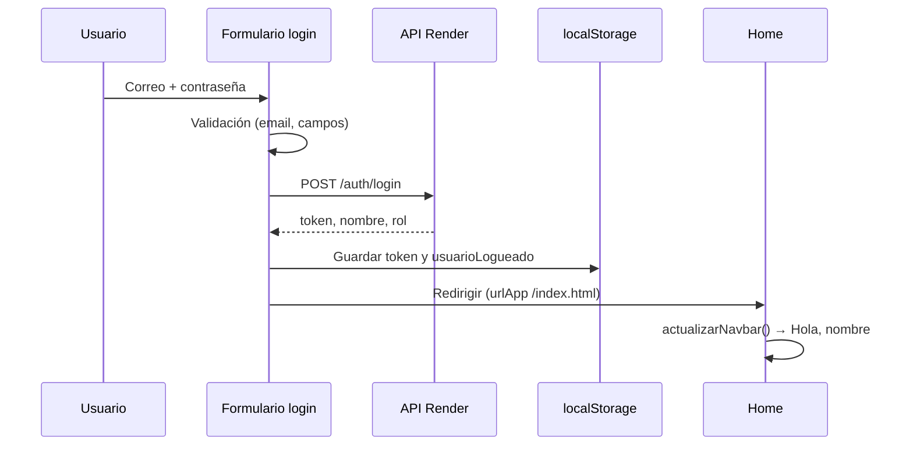

# 💈 Style Factory – Frontend

Interfaz web de **Style Factory**, salón de belleza y bienestar. Aquí el cliente conoce los servicios, se registra, inicia sesión, reserva citas y —con el rol adecuado— accede al panel de administración.

El sitio está hecho con **HTML, CSS y JavaScript** puro. No hay React ni Vue: los componentes (navbar, footer, formularios) se cargan con `fetch` y la autenticación se delega al API REST del backend.

## 🚀 Tecnologías

- **HTML5** + **CSS3**
- **Bootstrap 5.3.8** (layout responsive)
- **JavaScript** (ES6+, sin bundler)
- **Google Fonts** — Montserrat, Playfair Display
- **Font Awesome 6** (iconos)
- **Google Maps** (página de contacto)
- **Formspree** (formulario de contacto)
- **JWT** — sesión vía API (`stylefactory-backend`)

## 🌐 Enlaces del proyecto

| Recurso | URL |
|---------|-----|
| **Sitio publicado** | https://enithv.github.io/stylefactory/ |
| **Repositorio frontend** | https://github.com/EnithV/stylefactory |
| **API (Render)** | https://stylefactoryapi.onrender.com |
| **Repositorio backend** | https://github.com/EnithV/stylefactory-backend |
| **Swagger** | https://stylefactoryapi.onrender.com/swagger-ui/index.html |

## 📁 Estructura del proyecto

```
stylefactory/
├── index.html                      # Home
├── assets/
│   ├── css/
│   │   └── main.css
│   └── js/
│       ├── config.js               # API_BASE, rutas GitHub Pages, utilidades
│       ├── formValidaciones.js     # Validaciones compartidas de formularios
│       └── main.js                 # Navbar, sesión, carga de secciones en home
├── components/
│   ├── navbar/                     # Barra de navegación
│   ├── footer/
│   ├── forms/
│   │   ├── loginUsuario/           # Login (iframe en pages/login)
│   │   ├── registroUsuario/        # Registro (iframe en pages/registro)
│   │   ├── contacto/
│   │   ├── reserva/
│   │   ├── passwordToggle.js       # Mostrar/ocultar contraseña
│   │   └── ...
│   ├── bannerInicio/
│   ├── ServiciosDestacados/
│   └── review/
└── pages/
    ├── login/
    ├── registro/
    ├── contact/
    ├── catalogoServicios/
    ├── aboutUs/
    ├── reservations/
    └── admin/                      # Panel, listas de servicios y reservas
```

Las rutas del menú llevan el prefijo **`/stylefactory/`** porque GitHub Pages publica este repo como sitio de proyecto bajo `enithv.github.io`.

## 🗺️ Mapa del sitio

| Sección | Ruta | Descripción |
|---------|------|-------------|
| Inicio | `/index.html` | Banner, servicios destacados, reseñas |
| Servicios | `/pages/catalogoServicios/` | Catálogo completo |
| Nosotros | `/pages/aboutUs/` | Historia y propuesta del salón |
| Contacto | `/pages/contact/` | Formulario + mapa |
| Login | `/pages/login/` | Inicio de sesión |
| Registro | `/pages/registro/` | Alta de clientes |
| Reservas | `/pages/reservations/` | Flujo de reserva (sesión activa) |
| Admin | `/pages/admin/` | Panel de control |

## 🔐 Sesión y autenticación

### Flujo de login

1. El usuario completa el formulario en `components/forms/loginUsuario/` (embebido en un **iframe** dentro de `pages/login/`).
2. El frontend envía `POST {API_BASE}/auth/login` con `correo` y `contrasena`.
3. Si el API responde bien, se guarda en `localStorage`:
   - `token` — JWT para peticiones protegidas
   - `usuarioLogueado` — `{ nombre, correo, rol }`
4. Redirección a `/index.html` (cliente) o al panel admin (rol `ADMIN`).
5. El navbar ejecuta `actualizarNavbar()` y muestra **«Hola, {nombre}»**.

### Flujo de registro

Validación en cliente → `POST /auth/register` → mensaje de éxito → redirección a login con aviso de cuenta creada.

### Diagrama (login)



## ✅ Validaciones de formularios

Centralizadas en `assets/js/formValidaciones.js`:

| Campo | Regla |
|-------|--------|
| Nombre | Solo letras; aviso en tiempo real si hay números |
| Correo | Obligatorio + formato válido |
| Teléfono | Solo dígitos y separadores (`+`, `-`, espacios); sin letras |
| Contraseña | Mín. 8 caracteres, mayúscula, minúscula, número y símbolo |
| Confirmación | Debe coincidir con la contraseña |

Login y registro usan **`novalidate`** para mostrar errores en español (evita tooltips nativos ocultos dentro del iframe).

**Contraseña visible:** `passwordToggle.js` + icono de ojo en login y registro.

## ⚙️ Configuración (`assets/js/config.js`)

```javascript
const API_BASE = "https://stylefactoryapi.onrender.com";
const FRONTEND_BASE_URL = "https://enithv.github.io/stylefactory";
const GITHUB_PAGES_BASE_PATH = "/stylefactory";
```

Funciones útiles:

- `obtenerBaseAplicacion()` — detecta `/stylefactory` en GitHub Pages o raíz en local
- `urlApp('/index.html')` — arma rutas absolutas para redirecciones tras login/registro
- `mensajeErrorConexion(error)` — texto claro ante fallos de red o CORS

Para desarrollo contra API local, cambia `API_BASE` (ej. `http://localhost:8081`) y verifica CORS en el backend.

## 🛠️ Desarrollo local

### Requisitos

- Navegador reciente (Chrome, Firefox, Edge)
- Servidor estático (**Live Server**, `npx serve .`, etc.)

> **Importante:** no abras los `.html` con doble clic (`file://`). El API y la carga de componentes fallan o se bloquean por CORS.

### Pasos

```bash
git clone https://github.com/EnithV/stylefactory.git
cd stylefactory
```

Abre la carpeta con Live Server. URL típica:

`http://127.0.0.1:5500/stylefactory/index.html`

## 📤 Despliegue (GitHub Pages)

1. Repo **EnithV/stylefactory**, rama `main`
2. **Settings → Pages → Deploy from branch**
3. Carpeta **`/ (root)`**
4. Sitio en https://enithv.github.io/stylefactory/

Cada `push` a `main` actualiza la versión en línea (1–2 minutos).

## 🔗 Integración con el backend

| Acción | Endpoint | Cabeceras / cuerpo |
|--------|----------|-------------------|
| Registro | `POST /auth/register` | JSON: `nombre`, `correo`, `telefono`, `contrasena`, `rol` |
| Login | `POST /auth/login` | JSON: `correo`, `contrasena` |
| Recursos protegidos | `/servicios`, `/reservas`, … | `Authorization: Bearer {token}` |

En Render (plan gratis) la primera petición tras inactividad puede tardar ~1 minuto.

### Si aparece NetworkError

- Entra por GitHub Pages o `http://localhost`, no por `file://`
- Comprueba que Render tenga el servicio activo
- El backend debe permitir CORS desde `https://enithv.github.io`

## 📌 Notas importantes

- Los formularios de **login** y **registro** viven en **iframes**; las rutas de redirección usan `urlApp()` para no romper GitHub Pages.
- El **contacto** se envía con Formspree; no pasa por el API de Style Factory.
- Parte del **admin** y del **catálogo** aún usa `localStorage` para datos de prueba mientras avanza la integración total. La sesión (`token`, `usuarioLogueado`) sí depende del backend.

## ✅ Estado del frontend

- Home, catálogo, nosotros, contacto y formularios operativos
- Login y registro conectados al API
- Validaciones en tiempo real (nombre, teléfono, contraseña)
- Toggle mostrar/ocultar contraseña
- Navbar con sesión y enlace admin según rol
- Desplegado en GitHub Pages bajo `/stylefactory/`

---

*Style Factory — Cortes que inspiran.*  
Proyecto **Generation Colombia**. Frontend en este repo; API en [stylefactory-backend](https://github.com/EnithV/stylefactory-backend).
